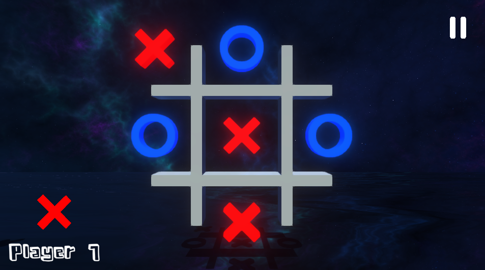

# Boter, Kaas en Eieren
This repository contains the Unity Project for the "Boter, Kaas en Eieren" game.

The game can be played on [Itch.io](https://stefanstegeman.itch.io/boter-kaas-eieren). Full Screen can be selected at the bottom right next to "BKE".

# Table of Contents
1. [Install](#install)
2. [Structure](#structure)
    1. [Folder Structure](#folder-structure)
    2. [Editor Structure](#editor-structure)
3. [Managers](#managers)
    1. [AudioManager](#audio-manager)
    2. [CanvasManager](#canvas-manager)
    3. [GridManager](#grid-manager)

# Install #
It is rather easy to install and open this Unity Project in the Unity Editor.
*Make sure you have atleast the Unity editor of 2020.3.23f1 or higher!*
1. Clone this Git repository.
2. In the UnityHub, click: **Add**
3. Select the folder **BKE** inside of the cloned repository.
4. Click on the newly added project **BKE** inside of the Unity Hub

# Structure #
## Folder Structure ##
The folder structure of the [Assets](https://github.com/StefanStegeman/BKE/tree/main/BKE/Assets) folder.

- [3D models](https://github.com/StefanStegeman/BKE/tree/main/BKE/Assets/3D%20Models)
- [Audio](https://github.com/StefanStegeman/BKE/tree/main/BKE/Assets/Audio)
    - [Music](https://github.com/StefanStegeman/BKE/tree/main/BKE/Assets/Audio/Music)
    - [SFX](https://github.com/StefanStegeman/BKE/tree/main/BKE/Assets/Audio/SFX)
- [Fonts](https://github.com/StefanStegeman/BKE/tree/main/BKE/Assets/Fonts)
    - [Blokeds](https://github.com/StefanStegeman/BKE/tree/main/BKE/Assets/Fonts/Blokeds)
    - [Regikan](https://github.com/StefanStegeman/BKE/tree/main/BKE/Assets/Fonts/Regikan)
- [Input](https://github.com/StefanStegeman/BKE/tree/main/BKE/Assets/Input)
- [Materials](https://github.com/StefanStegeman/BKE/tree/main/BKE/Assets/Materials)
- [Packages](https://github.com/StefanStegeman/BKE/tree/main/BKE/Assets/Packages)
- [Prefabs](https://github.com/StefanStegeman/BKE/tree/main/BKE/Assets/Prefabs)
- [Scenes](https://github.com/StefanStegeman/BKE/tree/main/BKE/Assets/Scenes)
- [Scripts](https://github.com/StefanStegeman/BKE/tree/main/BKE/Assets/Scripts/)
    - [Grid](https://github.com/StefanStegeman/BKE/tree/main/BKE/Assets/Scripts/Grid)
    - [Shape](https://github.com/StefanStegeman/BKE/tree/main/BKE/Assets/Scripts/Shape)
    - [UI](https://github.com/StefanStegeman/BKE/tree/main/BKE/Assets/Scripts/UI)
- [Textures](https://github.com/StefanStegeman/BKE/tree/main/BKE/Assets/Textures)
- [URP](https://github.com/StefanStegeman/BKE/tree/main/BKE/Assets/URP)

## Editor structure ##
### **Canvas** ###
---
The Canvas contains multiple different GameObjects. All of these GameObjects are a different window / screen.
All of these windows are a *UIElement* which is getting managed by the [CanvasManager](#canvas-manager) script.

The different windows all have their own elements. These elements are prefixed which makes it easier to know what each and every element is.
| Type | Prefix |
| ---- | -- |
| Text | T_ |
| Button | B_ |
| Image | I_ |
| Slider | S_ |

### **Grid** ###
---
The Grid exists of two different GameObjects: The walls and the ShapeHolders.

The walls are simply the visual 3D models which make up the shape of the grid. (4 manipulated cubes)
The ShapeHolders are, as the name implies, the places where the shapes will be placed on. The grid contains 3 rows of ShapeHolders: 
- Top Row
- Middle Row
- Bottom Row

Each and every row contains 3 ShapeHolders which makes it a 3x3 grid. All ShapeHolders contain a Box Collider and a MeshFilter.

# Managers #
Since Unity is very component based, it's rather common to have a lot of components. I chose to build some managers which couple and manage these components.

---
## Audio Manager ##
The [Audio Manager](https://github.com/StefanStegeman/BKE/blob/main/BKE/Assets/Scripts/AudioManager.cs) contains the two main AudioSources
- Music AudioSource
- SFX AudioSource

These AudioSources play the desired AudioClips given the situation.
Buttons e.g. call the PlaySFX() method on click, passing the desired AudioClip as parameter. This makes it easy to play sounds and also keep it clean.

The AudioManager can also mute and unmute sounds. It also supports sliders to control the vvolume of the specified AudioSource.

## Canvas Manager ##
The [Canvas manager](https://github.com/StefanStegeman/BKE/blob/main/BKE/Assets/Scripts/UI/CanvasManager.cs) handles all UI actions. It contains a list of all UIElements. Each UIElement contains a UIType which allows for quick and easy setup and management.

It is very easy to add and remove UIElements and UITypes. You can simply add the desired UIType in the enum

and add the *UIElement.cs* script to the GameObject
## Grid Manager ##
The Grid Manager is the core of this game. It manages both the 3D grid, as the logic behind it all. It couples and links 